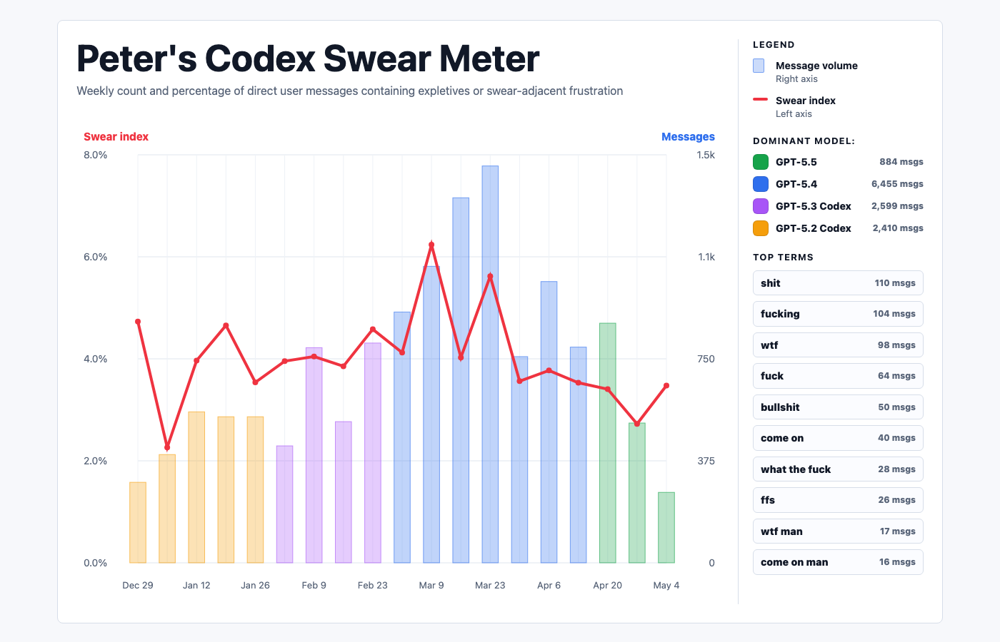

# Codex Swear Meter

Local tooling and a bundled Codex skill for auditing your own Codex session logs and
generating a weekly swear/frustration chart.



Content note: the starter lexicon contains profanity and other strong language
because the tool is explicitly designed to count those terms in local logs.

## What It Does

Codex Swear Meter reads local Codex logs, extracts direct user messages, counts
explicit swears and narrow swear-adjacent frustration phrases, and generates:

- a single HTML chart, `outputs/spice-timeline.html`
- weekly and monthly CSVs
- model timeline CSVs
- matched-message review samples for local inspection
- phrase candidates that help tune the lexicon to a new user's style

The visible chart is intentionally narrow: it is a **swear index**, not a general
sentiment score. It counts language like `wtf`, `fuck`, `bullshit`, `what the
hell`, `come on`, `this sucks`, `this is a mess`, or `wasting my time`. It does
not count ordinary engineering words like `bug`, `issue`, `problem`, or `error`
unless they appear inside a stronger frustration phrase.

The generated chart title personalizes from the local account name by default,
for example `Peter's Codex Swear Meter`. Use `--owner-name "Name"` if the local
account name is not the preferred display name.

## Privacy

Everything runs locally. The tool does not upload logs.

`outputs/` is gitignored because it contains private conversation-derived data.
Do not publish raw CSVs, snippets, or extracted messages unless you explicitly
intend to share them. Even screenshots can reveal usage patterns, model choices,
and rough activity volume.

## Quick Start

From a checkout:

```bash
python3 -m pip install -e .
codex-swear-meter audit --out-dir outputs
```

Then open:

```text
outputs/spice-timeline.html
```

The command runs locally against `~/.codex` by default. It may take a little
while on a large Codex history because it scans raw JSONL session files and then
builds CSVs plus a static HTML chart. Re-running is safe; files in `outputs/`
are overwritten.

Useful options:

```bash
codex-swear-meter audit --codex-home ~/.codex --out-dir outputs --owner-name "Your Name"
codex-swear-meter incremental --out-dir outputs
codex-swear-meter analyze --messages outputs/user_messages.jsonl --out-dir outputs
codex-swear-meter extract --codex-home ~/.codex --out outputs/user_messages.jsonl
```

To check whether the chart is stale, run:

```bash
codex-swear-meter incremental --out-dir outputs
```

This compares `outputs/user_messages.jsonl` with the current raw Codex logs,
writes `outputs/incremental/new_user_messages.jsonl`, and analyzes only those
new messages in `outputs/incremental/`. If the status file says
`needs_refresh: true`, run `codex-swear-meter audit --out-dir outputs` to rebuild
the main chart from the fresh corpus.

The chart shows:

- bars: weekly direct user-message volume
- line: weekly `swear_index_message_rate`, the percentage of extracted direct user messages that contain at least one counted swear-index term
- right rail: newest-first dominant model colors with total message counts
- top terms: data-backed terms from the actual counted swear-index matches

## Using The Skill

This repository includes an installable Codex skill at:

```text
skills/codex-swear-meter
```

To install it locally:

```bash
cp -R skills/codex-swear-meter ~/.codex/skills/codex-swear-meter
```

Then ask Codex:

```text
Use $codex-swear-meter to audit my local Codex logs and generate a weekly swear-meter chart.
```

The skill includes:

- `SKILL.md`: concise agent workflow
- `scripts/codex_swear_meter.py`: standalone standard-library script
- `assets/negative_terms.json`: broad review lexicon
- `assets/swear_index_terms.json`: starter swear-index lexicon
- `references/adaptation.md`: guidance for tuning the metric to a different user

## Adapting To A Different User

The default lexicon is only a starting point. If someone runs only the script,
they get the starter lexicon plus their own local logs and personalized title.
If they ask Codex to use the skill, the agent should adapt the copied lexicon to
that user's own wording before treating the result as final.

Recommended process:

1. Run the default audit.
2. Inspect `outputs/spice_term_counts.csv` to see what actually matched.
3. Inspect `outputs/spice_messages.csv` for false positives.
4. Inspect `outputs/candidate_phrases.csv` for repeated user-specific phrases.
5. Tune a copied lexicon, not the bundled default.
6. Re-run and compare the top terms.

Good additions are phrase-level and high precision, such as `what the hell are
you doing`, `this is awful`, `this sucks`, `not good enough`, `wasting my time`,
or `made it worse`. Avoid broad single words that mostly describe normal work.

Ambiguous phrases should be handled deliberately. For example, `start again`,
`delete this`, and `try again` are often ordinary workflow language, so the
starter lexicon keeps them as review leads instead of chart-counting terms.
Use `swear_index_excluded_terms` for phrases like that: they remain visible in
local review CSVs but do not inflate the visible index by themselves.

For larger or unfamiliar corpora, split the tuning pass across reader agents:
one precision reader for false positives, one recall reader for missed
phrase-level frustration, and one chart/skill reader for presentation quality.
The coordinator should merge only terms with current-corpus evidence.

## Outputs

- `user_messages.jsonl`: extracted direct user messages
- `summary.json`: top-level counts and date range
- `spice-timeline.html`: the shareable local chart
- `spice_timeline_weekly.csv`: weekly swear-index and broader friction rates
- `spice_timeline_monthly.csv`: monthly equivalent
- `spice_term_counts.csv`: counted terms, grouped by signal family
- `spice_messages.csv`: matched rows with snippets for local review
- `candidate_phrases.csv`: compact phrase candidates for lexicon tuning
- `model_timeline_weekly.csv`: weekly dominant/runner-up model labels
- `model_counts.csv`: overall model mix and rates

The historical file names use `spice` internally. The chart and README call the
visible metric a swear index.

## What Gets Published

The repository is safe to publish with source, starter lexicons, tests, docs,
and the approved screenshot. Private generated data stays out of Git:

- `outputs/` is ignored except for `.gitkeep`
- `reports/` is ignored
- raw user messages, matched snippets, and generated CSVs should stay local

## Development

Run checks:

```bash
python3 -m pip install -e .
python3 -m unittest discover -s tests
python3 -m compileall -q src tests
```

Validate the bundled skill:

```bash
python3 ~/.codex/skills/.system/skill-creator/scripts/quick_validate.py skills/codex-swear-meter
```

If your Python environment does not have `PyYAML`, run the validator from a
temporary venv with `PyYAML` installed.

## Open-Source Checklist

Before publishing:

- choose and add a license
- remove or keep gitignored any private `outputs/`
- keep only approved screenshots in `docs/`
- test the skill from a clean checkout
- make clear that results are review leads, not psychological labels
